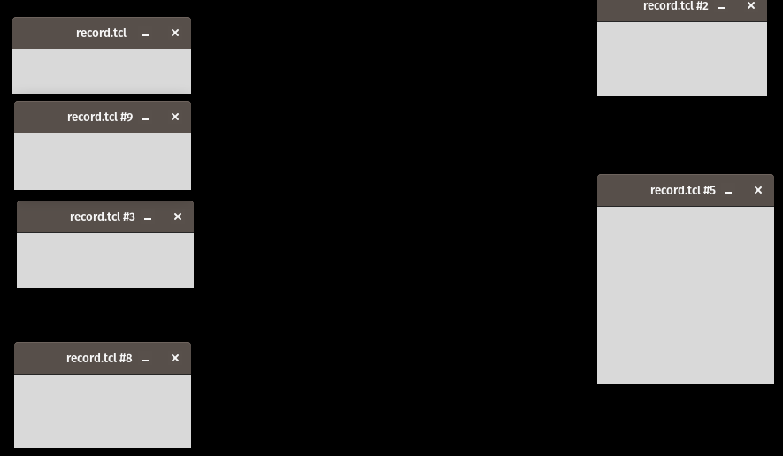

# tclrecord

A simple audio recorder.

It's good to use with USB foot pedal or Joypad.

## Installation
    
    $ sudo apt install tcl-snack

## How to use

    $ ./record.tcl &

( You can launch multiple `record.tcl` to keep multiple records )

### Keyboard

- a: record
- b: play
- c: stop

Edit `record.tcl` directly to assign other keys.

## For...

- Singing, playing musical instruments
- Speech, speaking and language learning
- Song arrangement, songwriting
